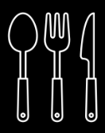

<h1 align="center"><b><i>The Spoonful Blog</b></i></h1>

This is a full-stack blog application post and review different foods and recipes! 

## Getting Started

In order to install this project locally, you can use the command <code>'git clone'</code> (Please make sure that you have the latest version of Node and React as this is required)

Once you have cloned down the repository please follow these steps:

1. In order to install all dependencies associated with the application run the following command: <code>'npm install'</code>
2. To seed all of the associated run <code>'npm run seed'</code>
3. To run the server locally, run  <code>'npm start'</code>
4. To run the client-dev(GUI) environment locally, run <code>'npm run client-dev'</code>

## Collaborators 

This app was brought to you by the Spoonful crew:

* <i>Deja Clarke</i>
* <i>Addy Rodriguez</i>
* <i>Krystal Lopez</i>

This application was built through multiple collaborative efforts. Krystal built the skeleton or the backend setting up the models and application middleware so that HTTP requests can be parsed properly, Deja created the routes and Addy created the seed file, seed data, as well as the tests so that we can make sure that all routes are working approprioately. 

The front-end was built using React. We worked together to create the front-end as we wanted to create a warm and aesthetically pleasing UI. Krystal built out the components that there needed to set up the application initially. Deja created the styling and helped with the design and color scheme. Addy worked on the navigation bar and also assisted with the styling as well. Together, we collaborated on how we wanted the logo to look as well as the theme that we wanted for our app. 

Overall this app was built using a pair-programming method, with each member taking turns as the navigator and the driver. Each member of this team contributed equally and creatively. 

We hope you enjoy our application!

## Resources

Below are some of the resources that we used to help build our fullstack application: 

* [Building a RESTful API with Node.js](https://www.youtube.com/playlist?list=PL55RiY5tL51q4D-B63KBnygU6opNPFk_q)
* [Excalidraw](https://excalidraw.com/)
* [ReactJS Tutorial for Beginners](https://www.youtube.com/playlist?list=PLC3y8-rFHvwgg3vaYJgHGnModB54rxOk3)
* [Make Your Own Logo (LOGO)](https://app.logo.com/business-name/)
* [Getting Started with Bootstrap](https://getbootstrap.com/docs/5.3/getting-started/introduction/)